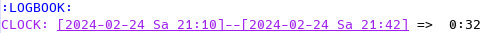
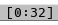

# org-clock-agenda-daytime-mode

Emacs mode to display the time clocked today in the modeline.

See
[org-clock-agenda-daytime-mode.el](org-clock-agenda-daytime-mode.el)
for usage instructions (as is common for emacs packages).

## Screenshots

If you clocked 32 minutes in total for today in the LOGBOOK drawer:

You see that time shown in the modeline:

